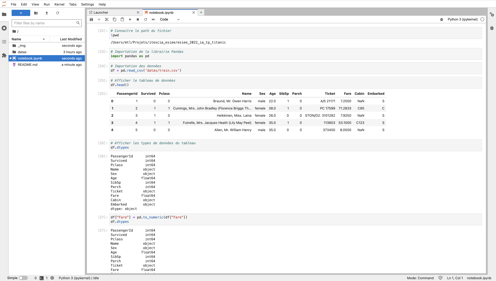

# ESIEE - 2022 - IA - TP - Titanic
 
## 1 - Installation de Jupyter

### 1.1 - Préparation de l'environement

```
python3 -m venv venv
source venv/bin/activate
pip install --upgrade pip
pip install -r requirements.txt
```

> Si besoin : [source de jupyter](https://jupyter.org/install)

### 1.2 - Construction de Jupyter

```
jupyter lab build
```

### 1.3 - Démarrer Jupyter

```
jupyter-lab
```

Ouvrir normalement automatique une page web : http://localhost:8888/lab.


## 2 - Jupyter - Utilisation

## 2.1 - Création et utilisation d'un **Notebook**

### 2.1.2 - Qu'est-ce qu'un Notebook dans Jupyter

Un document Jupyter Notebook est un document JSON. Il suit un schéma contenant une liste ordonnée de cellules d'entrée/sortie. Celles-ci peuvent contenir du code, du texte (à l'aide de Markdown), des formules mathématiques, des graphiques et des médias interactifs. Ce document se termine généralement par l'extension ".ipynb".

[Source - wiki](https://fr.wikipedia.org/wiki/Jupyter#Jupyter_Notebook)

### 2.1.1 - Exemple de création et de lecture d'un fichier Notebook


> Fichier de démo --> [**notebook_001.ipynb**](notebook_001.ipynb)

### 2.1.1 - Exemple d'exécution d'un fichier Notebook



> Fichier de démo --> [**notebook_001.ipynb**](notebook_001.ipynb)

## 2.2 - Notebook disponibles

1. [**notebook_001.ipynb**](notebook_001.ipynb)
2. [**notebook_002.ipynb**](notebook_002.ipynb)